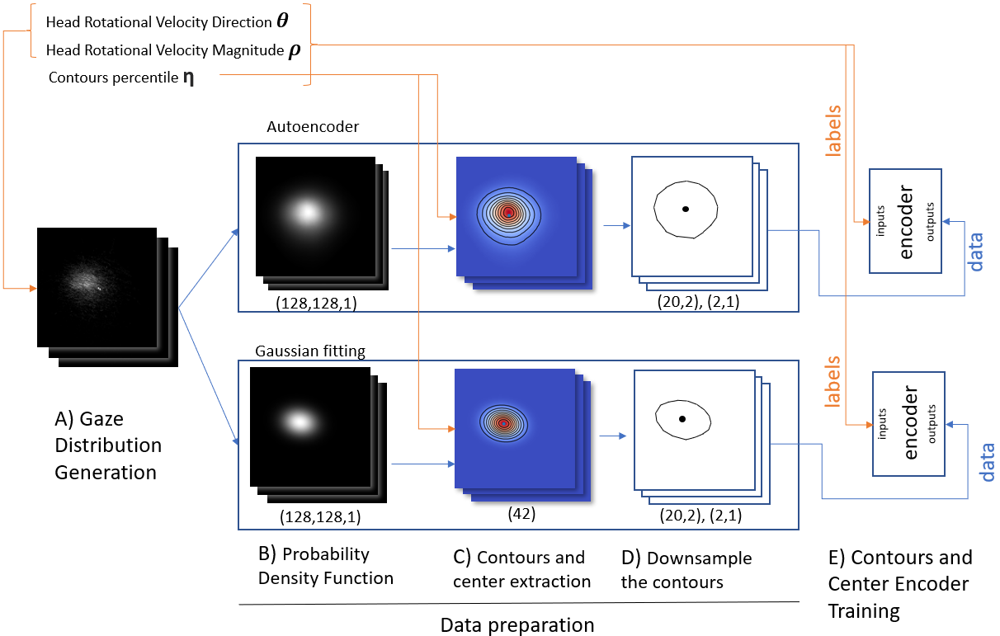
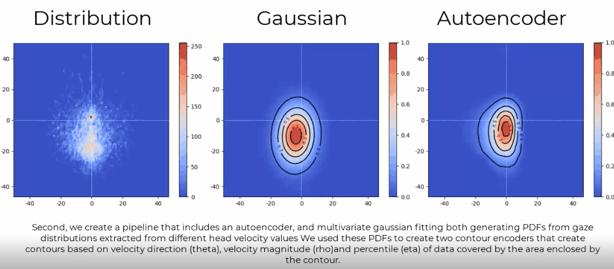

# VR Iso Gaze Contours

## Step 1 - get the dataset
Dataset either download 
- https://gin.g-node.org/ioannis.agtzidis/360_em_dataset
- https://drive.google.com/file/d/1Ot49ymfZh9UjXrA4vDW9HAq9x_YmL8kg/view?usp=sharing

## Step 2 - Generate the model 

<p align="center">
  
</p>

Our model's three-stage training pipeline involves two deep learning models and a contour extraction phase to process velocity angle and magnitude (theta,rho) to generate the contour that contains the requested probability of gaze area. The contour encloses the visual interest area and includes the predicted gaze location. The first pipeline training stage consists of an autoencoder reconstructing the 2D PDF from gaze location distribution samples, or an MGF approach. The second stage is a multi-perceptron architecture that encodes contours from the angles and magnitudes of head-shift velocity.

The pipeline sequence of steps is contained in : python_model/main_controller.py 

which will allow you to run trough the following steps:

### A) data --> angular velocities (generateParameters.py) 

In this step we parse the dataset so that we can have our angular velocity magnitude and direction to create gaze distributions based on this two parameters. 

### B) angular velocities --> distributions (deeplearning\\distributions.py)

<p align="center">
  
</p>

Because we noticed that the gaze samples did not always have a Gaussian shape we generated PDFs with two different methods. Firstly, by using a trained autoencoder 2) that captures the shape of the distribution and secondly, by fitting a multivariate Gaussian distribution MGF 1).

#### 1) Multivariate Gaussian Fitting (2DgaussianFitting.py)

Our proposed MGF is implemented so that the Gaussian shape can fit with a tilt value, and follow the distribution shape. We used Scipy 1.7.2 to calculate MGF. This training set and the PDF autoencoder set are created starting with the same samples using random $\theta$  and $\rho$.

#### 2) Autoencoder (deeplearning\\autoencoder_training.py, deeplearning\\autoencoder_prediction.py)

The autoencoder aims to provide an alternative approach to the standard Gaussian model. We developed the PDF autoencoder with Keras/Tensorflow 2.7.0. The PDF autoencoder has a standard autoencoder architecture and is trained with a list of multivariate distributions such as Gaussian, Poisson and Skewed Gaussian. We generates a training set with the distributions' PDFs as labels and data that are generated by applying uniform noises to PDFs. Such a method achieves a visually similar distribution to the real-world gaze-tracking data.

### C) distributions --> contours (contours.py)

The PDF images generated by the auto-encoder and the MGF are then processed to extract contours. Every percentile-based contour is associated with the two parameters of head velocity (theta,rho) and the percentile value (eta). 

### D) train encoder with contours  (deeplearning\\countour_encoder.py)

The second part of the training pipeline consisted of the Contour Encoder, which is used when predicting the contour and the gaze location. We visualize the PDF as an iso-contour adopting a lower dimensionality than a PDF gradient. After a geometric downsample, each contour is reduced to a sequence of 20 points with two coordinates.

## Step3 - Import the model in unity 
We use TensorflowLite to port the model to an untethered VR headset by converting the model to an Android-compatible version that can be loaded and executed via the Unity framework.
- The model for tensorflow light can be generated by using the file: python_model/keras2tflite.py
- Install TensorFlow Lite for Unity by adding git URL from the Package Maneger UI: https://github.com/asus4/tf-lite-unity-sample.git?path=/Packages/com.github.asus4.tflite
- Install TensorFlow Lite common for Unity by adding git URL from the Package Maneger UI: https://github.com/asus4/tf-lite-unity-sample.git?path=/Packages/com.github.asus4.tflite.common
- the folder unity_project contains a scene ready to be tested   [Scene_Iso_Gaze.unity](https://github.com/Collaborative-Immersive-Visual-Toolkit/VR_Iso_Gaze_Contours/blob/main/unity_project/Assets/Scenes/Scene_Iso_Gaze.unity)
and a sample cs file [IsoGazeSample.cs](https://github.com/Collaborative-Immersive-Visual-Toolkit/VR_Iso_Gaze_Contours/blob/main/unity_project/Assets/Scripts/IsoGazeSample.cs)


```c#
using TensorFlowLite;

public class IsoGazeSample : MonoBehaviour
{
  
  Interpreter interpreter;
  float[] inputs = new float[4];
  float[] gaussianContour = new float[42]; 
  float[] gaussianCenter = new float[2];
  float[] autoencoderContour = new float[42]; 
  float[] autoencoderCenter = new float[2];
    
  //initialize the model 
  void Start()
  {
      var options = new InterpreterOptions()
      {
          threads = 2,
          useNNAPI = true,
      };
      interpreter = new Interpreter(TensorFlowLite.FileUtil.LoadFile(fileName), options);
      interpreter.ResizeInputTensor(0, new int[] { 1, 4 });
      interpreter.AllocateTensors();

      inputBuffer = new ComputeBuffer(4, sizeof(float));
  }
  
  //inference
  void Update()
  {
        inputs[0] = //sin of the angle of the rotational velocity with the vector3 up (read paper)
        inputs[1] = //cos of the angle of the rotational velocity with the vector3 up (read paper) 
        inputs[2] = //rotational velocity magnitude in degree/s (read paper)
        inputs[3] = //amount in unit scale of the data enclosed by the output contour (read paper)
        
        interpreter.SetInputTensorData(0, inputs);
        interpreter.Invoke();
        interpreter.GetOutputTensorData(0, gaussianContour);
        interpreter.GetOutputTensorData(1, gaussianCenter);
        interpreter.GetOutputTensorData(3, autoencoderContour);
        interpreter.GetOutputTensorData(4, autoencoderCenter);
        
        //visualize your outputs here bare in mind that the ourputs are array of floats [x1,y1,x2,y2...xn,yn] 
        //where x is the longitudinal coordinate expressed in degrees
        //and y is the latidudinal coordinate express in degrees 
        //both latitude and longitude coorinates are local to the central eye camera (the cyclopic camera used by your hmd)
        // so what you want to do is for trasform each pair of coordinates long and lat into rays to project in the scene
  }
  
```

In the Video the blue dot represents the head direction while the red one the predicted gaze, the contour represent the 70% of the data 

<p align="center">
  
</p>


@inproceedings{10.1145/3517031.3529642,<br>
    author = {Bovo, Riccardo and Giunchi, Daniele and Sidenmark, Ludwig and Gellersen, Hans and Costanza, Enrico and Heinis, Thomas},<br>
    title = {Real-Time Head-Based Deep-Learning Model for Gaze Probability Regions in Collaborative VR}, <br>
    year = {2022}, <br>
    isbn = {9781450392525},<br>
    publisher = {Association for Computing Machinery},<br>
    address = {New York, NY, USA},<br>
    url = {https://doi.org/10.1145/3517031.3529642},<br>
    doi = {10.1145/3517031.3529642},<br>
    booktitle = {2022 Symposium on Eye Tracking Research and Applications},<br>
    articleno = {6},<br>
    numpages = {8},<br>
    keywords = {neural networks, visual attention, gaze inference, gaze prediction},<br>
    location = {Seattle, WA, USA},<br>
    series = {ETRA '22}<br>
}

